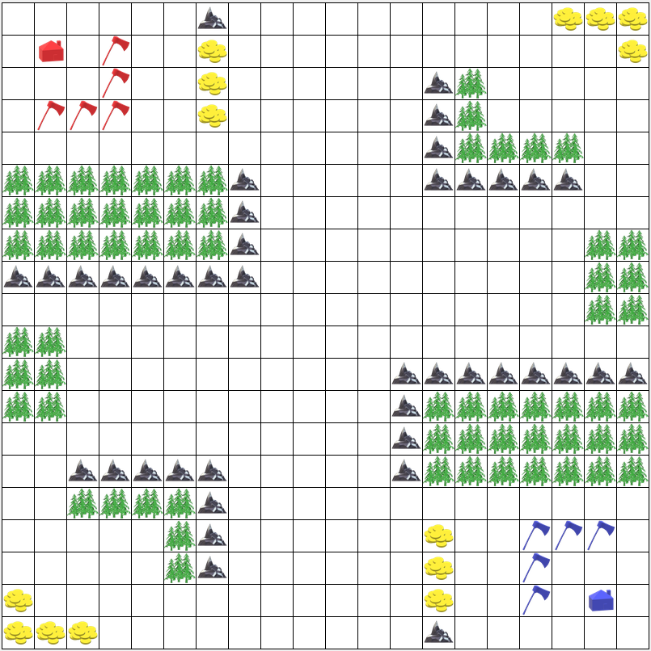
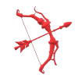
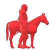
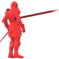
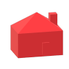

# Warcode 2020 Specifications
## Overview
Thrust into a dark age by the onslaught of a robovirus, the silicon inhabitants
of the planet Terrus must fight for control of scarce resources to survive and
propagate.  Critical to their success as a people is the element gold, a highly
conductive yellow metal making up large portions of their brains.  A large amount
of gold has recently been found by some silicoids on the west side of their
continent in a region named Kolkis.  Factions arise as robots race to take
control of the gold.

## Goal
You are the leader of either the
**R**obotic **E**nemy **D**estroyers
(<span style="color: red">RED</span>)
or the
**B**ionic **L**ethal **U**nited **E**ntities
(<span style="color: blue">BLUE</span>).
Your goal is to destroy the other team so that you can claim the gold in Kolkis.

## Resources
There are two resources in the game:
1. Wood
2. Gold

Wood is collected by cutting down trees around the map.  Gold is collected by
mining from gold mines.  Only peasants can collect wood and gold.  All resources
collected are immediately transferred to a global pool that any of your robots
can use.

## Map
<center>Example Map:
<br>

</center>
The map is a rectangular grid.  Each tile is either empty or contains a wall, a
gold mine, a tree, or a robot.  Units may only move to empty tiles.

#### Guarantees:
1. Every map will be symmetric about a line or a point.
2. Players will start with at least one house and one peasant.
3. There will be at least one tree and at least one gold mine easily accessible
and in view of every starting house.
4.  No map will have fewer than 100 tiles or more than 3,200 tiles.
5.  Between every pair of empty tiles, there exists a path consisting only of
trees or empty tiles.

## Trees and Gold Mines
####  Tree
Peasants can cut down trees adjacent to them to collect wood.  They get 10 wood
per turn while doing so, for which the tree loses 10 health.  When the tree's
health is non-positive, it disappears from the map, leaving the tile it was on
empty.  Other units can damage trees, but do not get wood for doing so.  Units
cannot move onto trees.

####  Gold Mine
Peasants can collect gold from adjacent gold mines.  They get 10 gold per turn
while doing so, for which the gold mine loses 10 health.  When the gold mine's
health becomes non-positive, it turns into a wall.  Other units can not harm
gold mines.  Units can not move onto gold mines.

## Robots
Robots are controlled by the player.  There are two kinds of robots:  units,
which can move, and buildings, which can not move.

Every turn, each robot may take as many distinct actions as it desires.  Possible
actions include mining, cutting a tree, moving, attacking, and building another
robot.

If a player fails to output a semicolon separated list of actions in time, the
robot will explode.  The robot will also explode if the player's code terminates
for any reason, for example by throwing an uncaught exception.

### Units
####  Archer
Archers are cheap, quick units that can attack from a long distance away.
####  Horse
Horses are expensive, armored units that can move quickly and pack a punch.
####  Peasant
Peasants are the backbone of your army.  They gather resources to support your
army and build houses to produce units.
####  Pike
Pikes are slow but tough units capable of withstanding a charge.
### Buildings
####  House
The house is the only building.  It can build every kind of unit.

### Table of Values
| Robot Type | Gold Cost | Wood Cost | Starting Health | Vision Radius | Move Radius | Attack Radius | Damage Radius | Attack Damage | Time Limit (ms) |
| ---------- | --------- | --------- | --------------- | ------------- | ----------- | ------------- | ------------- | ------------- | --------------- |
| Archer     | 80        | 50        | 50              | 150           | 2           | 80            | 0             | 10            | 20              |
| Horse      | 150       | 100       | 100             | 80            | 5           | 1             | 0             | 30            | 20              |
| Peasant    | 50        | 20        | 50              | 60            | 2           | n/a           | n/a           | n/a           | 20              |
| Pike       | 100       | 120       | 150             | 80            | 1           | 5             | 0             | 10            | 20              |
| House      | 500       | 800       | 300             | 100           | n/a         | n/a           | n/a           | n/a           | 20              |

## Distance Squared
In order to not have to deal with square roots and floating point errors, we
are using the distance squared.  For example, a robot 2 down and 3 to the right
of a different robot would be at a distance squared of 13.  All radii given
in the table above are in terms of distance squared.

## Turn Queue
Robots are placed in a turn queue.  Newly created robots are appended to the end
of the turn queue at the end of the turn they are created.  This means it is
possible for a newly created robot to be attacked twice before it gets a chance
to take an action.

## Communicating with the Engine
Players communicate with the engine using standard input and output.

At the
beginning of each turn, the player is sent json encoded data to its standard
input.  The data looks like the following:
```json
{
    "map": [
        ["?", "?", ..., "?"],
        ["?", "?", ..., "?"],
        ...,
        ["?", "?", ..., "?"]
    ],
    "trees": [
        {"x": 1, "y": 1, "health": 100, "id": 123},
        ...
    ],
    "gold_mines": [
        {"x": 2, "y": 2, "health": 500, "id": 234},
        ...
    ],
    "robots": [
        {"x": 3, "y": 3, "type": "ARCHER", "team": "RED", "health": 80, "id": 345},
        ...
    ]
}
```

The map consists of a 2d array.  The values in the 2d array are either an integer,
the id of a tree, gold mine, or robot, or one of " ", "W", or "?", representing
an empty tile, a wall, or an unknown tile.  Tiles outside the vision radius will
be given as a "?", and robots, trees, and gold mines outside of the vision radius
will not be provided.

The player's process is then unpaused.

The player has until it's time limit to output its actions to stdout.  If it
fails to do so, the robot it controls explodes.  The output should be a semicolon
separated list of actions to take.  A full list of actions is listed below.
A sample output could be
```
ATTACK 1 1; ...; MOVE 1 2;
```
Any actions that are empty will be ignored.  Invalid actions will print out a
warning.

The player's process is then paused until it is time for its turn again.

## Actions

1. `ATTACK [x] [y]` -- Attack the location (x, y).  A robot can only attack a
location within its attack radius.  If it tries to do otherwise, its attack will
do nothing.
2. `BUILD [x] [y] [TYPE]` -- Build a robot of type `TYPE` at the location (x, y).
A robot can only build on adjacent tiles.  Only a peasant can build a house, and
only houses can build units.
3. `CUT [id]` -- Cut the tree with the given id.  For peasants only.
4. `EXPLODE` -- Commit suicide.
5. `MINE [id]` -- Mine from the gold mine with the given id.  For peasants only.
6. `MOVE [x] [y]` -- Move to the location (x, y).  Attempting to move outside
a robot's move radius will waste the robot's move.
