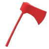

# Warcode 2020 Specifications
## Overview
Thrust into a dark age by the development of a robovirus, the silicon inhabitants
of the planet Terrus must fight for control of scarce resources to survive and
propagate.  Critical to their success as a people is the element gold, a highly
conductive yellow metal making up large portions of their brains.  A large amount
of gold has recently been found by some silicoids on the west side of their
continent, in a region named Kolkis.  However, the gold could not stay secret
for long...

## Goal
You are the leader of either the
**R**obotic **E**nemy **D**estroyers
(RED)
or the
**B**ionic **L**ethal **U**nited **E**ntities
(BLUE).
Your goal is to destroy the other team so that you can claim the gold in Kolkis.

## Resources
There are two resources in the game:
1. Wood
2. Gold

Wood is collected by cutting down trees around the map.  Gold is collected by
mining from gold mines.  Only peasants can collect wood and gold.  All resources
collected are immediately transferred to a global pool that any of your robots
can use.

## Map

Example Map:

The map is a rectangular grid.  Each tile is either empty or contains a wall, a
gold mine, a tree, or a robot.  Units may only move to empty tiles.

#### Guarantees:
1. Every map will be symmetric about a line or a point.
2. Players will start with at least one house and one peasant.
3. There will be at least one tree and at least one gold mine easily accessible
and in view of every starting house.
4.  No map will have fewer than 100 tiles or more than 3,200 tiles.
5.  Between every pair of empty tiles, there exists a path consisting only of
trees or empty tiles.

## Trees and Gold Mines
####  Tree
Peasants can cut down trees adjacent to them to collect wood.  They get 10 wood
per turn while doing so, for which the tree loses 10 health.  When the tree's
health is non-positive, it disappears from the map, leaving the tile it was on
empty.  Other units can damage trees, but do not get wood for doing so.  Units
cannot move onto trees.

####  Gold Mine
Peasants can collect gold from adjacent gold mines.  They get 10 gold per turn
while doing so, for which the gold mine loses 10 health.  When the gold mine's
health becomes non-positive, it turns into a wall.  Other units can not harm
gold mines.  Units can not move onto gold mines.

## Robots
Robots are controlled by the player.  There are two kinds of robots:  units,
which can move, and buildings, which can not move.

### Units
####  Archer
####  Horse
####  Peasant
####  Pike
### Buildings
####  House
